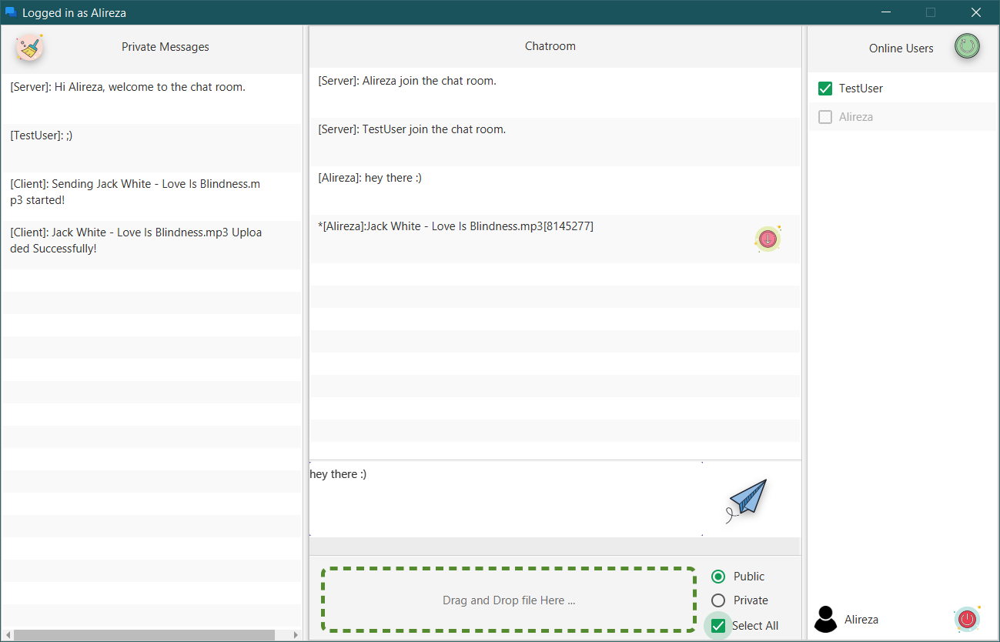
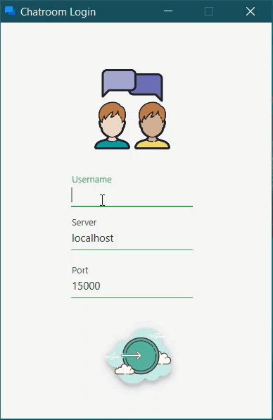

# SimpleChatroom

This is my network course project, i used from Java and JavaFX to impliment it and used some
extra libraries :

JavaFX Material Design Library : [JFoenix](https://github.com/jfoenixadmin/JFoenix)

Logging Library : [log4j](https://github.com/apache/log4j)

**Minumum required java is: `java 8`**

You can :

* Send a text message (Public or Private)

* Send a file (Public or Private)

* See online users (Realtime)

* Want more? come ooooon! This is a fucking simple project for university course dude :))

## Runnig

`ClientRunner.java` in Client package is the Client Main function.

`ServerRunner.java` in Server package is the Server Main function.

By default, (For message passing) the server listens on port `15000` with `100` client capacity

Server's file downloader socket listens on `15001`

Client's file downloader socket listens on `15002`

You can also change the server default port and its capacity using command-line arguments :

```bat
java ServerRunner [PORT_NUMBER] [CAPACITY]
```

Server file downloader and client file downloader sockets ports will change
based on this new value:

`SERVER FILE DOWNLOADER PORT = PORT_NUMBER + 1`

`CLIENT FILE DOWNLOADER PORT = PORT_NUMBER + 2`

To communicate between client and server to each other I used some message with
specific format (protocol), you can see this list below (And some additional response codes):

## MESSAGES

* Client to Server Messages :
  * `Public Message` :

     ```bash
    Public message, length=<CharCount>
    <Message>
    ```

  * `Private Message` :

    ```bash
    Private message, length=<CharCount> to <User1>,<User2>
    <Message>
    ```

  * `Private File Sending Message` :

    ```bash
    PFile message, name<FileName>, length<Byte>, <User1>, <User2>
    ```

  * `Public File Sending Message` :

    ```bash
    File message, name<FileName>, length<Byte>
    ```

  * `Download Request Message` :

    ```bash
    Download, FileName, <PrivateMessageSender>
    ```

  * `HandShake Message` :

    ```bash
    Hello<User>
    ```

  * `Logout Request` :

    ```bash
    Bye.
    ```

  * `Requesting Online Users` :

    ```bash
    Please send the list of attendees.
    ```

* Server to Client Messages:

  * `Public Message` :

    ```bash
        Public message, length=<CharCount> from <User3>
        <Message>
    ```

  * `Private Message` :

    ```bash
       Private message, length=<CharCount> from <User3> to <User1>,<User2>
       <Message>
     ```

  * `Private File Sending Message` :

    ```bash
        PFile message, from<User3>, name<FileName>, length<Byte>, <User1>, <User2>
    ```

  * `Public File Sending Message` :

     ```bash
        File message, from<User3>, name<FileName>, length<Byte>
    ```

  * `User logout` :

    ```bash
        Server, 301, User left the chat room.
    ```

  * `Welcome` :

    ```bash
        Server, 201, Hi User, welcome to the chat room.
    ```

  * `User Join Public Message` :

    ```bash
        User join the chat room.
    ```

## List of Status Messages

* `SENDING_PRIVATE_MESSAGE_WAS_SUCCESSFUL` = 200
* `HANDSHAKE_ACCEPTED` = 201
* `LIST_PASSED` = 202
* `READY_TO_GET_FILE` = 203
* `LOG_OUT` = 301
* `USER_LOGOUT` = 302
* `HANDSHAKE_REJECTED` = 400
* `FILE_UPLOADING_REJECTED` = 401
* `FILE_DOWNLOADING_REJECTED` = 402
* `SENDING_PRIVATE_MESSAGE_WAS_NOT_SUCCESSFUL` = 403
* `FILE_REMOVED` = 404
* `SERVER_ERROR` = 500

## Demo

### Main Page Window



### Failed to login



## TODO

* `Fix Multiuser private file sending bug`

* Adding more accurate username validation in both server and client-side

* Adding progress bar for downloading and uploading process

* Changing file size format message to a readable one (KB, MB or GB)

* Using Gradle for building the project (Handling dependencies)

* Making jar file for both client and server application

* Adding more demo :)
